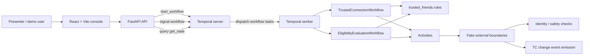
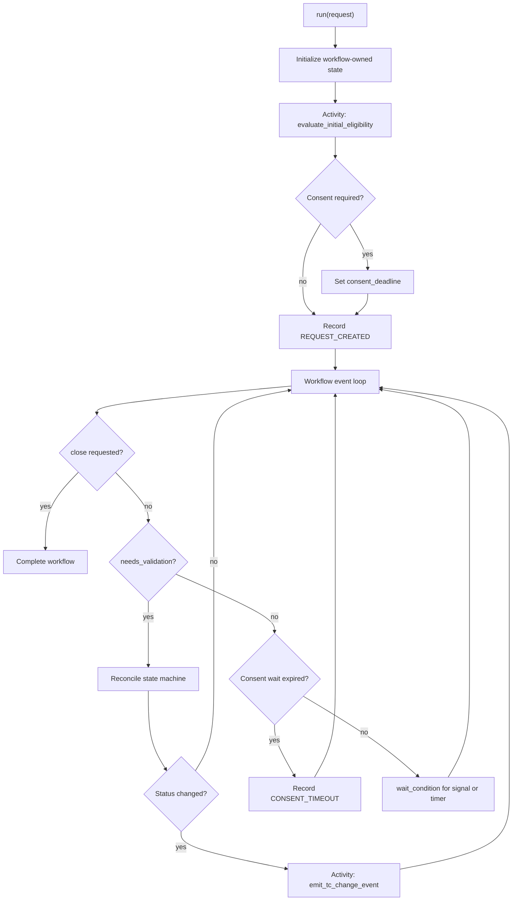
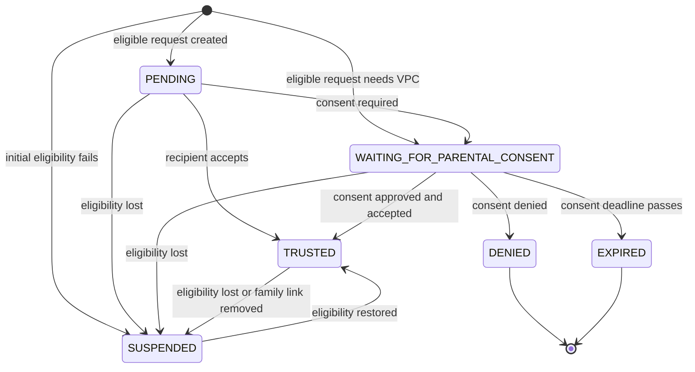
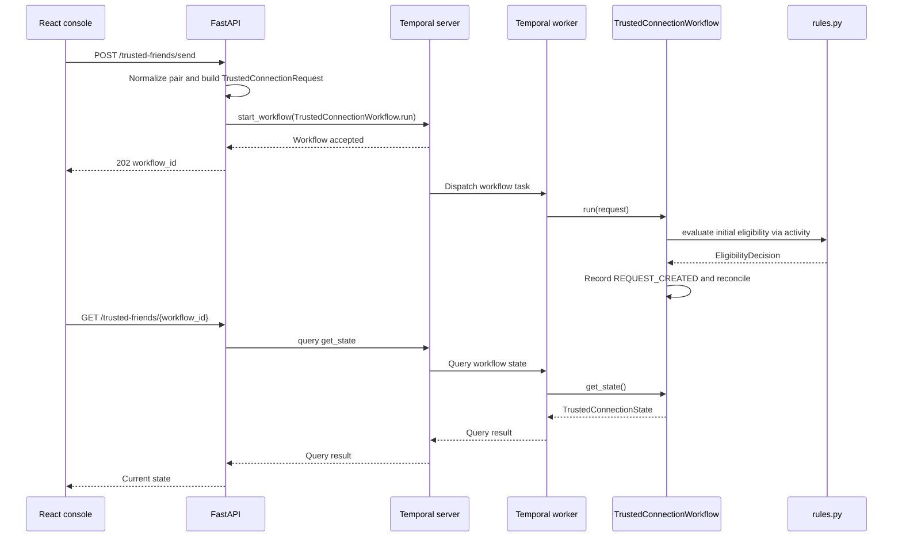
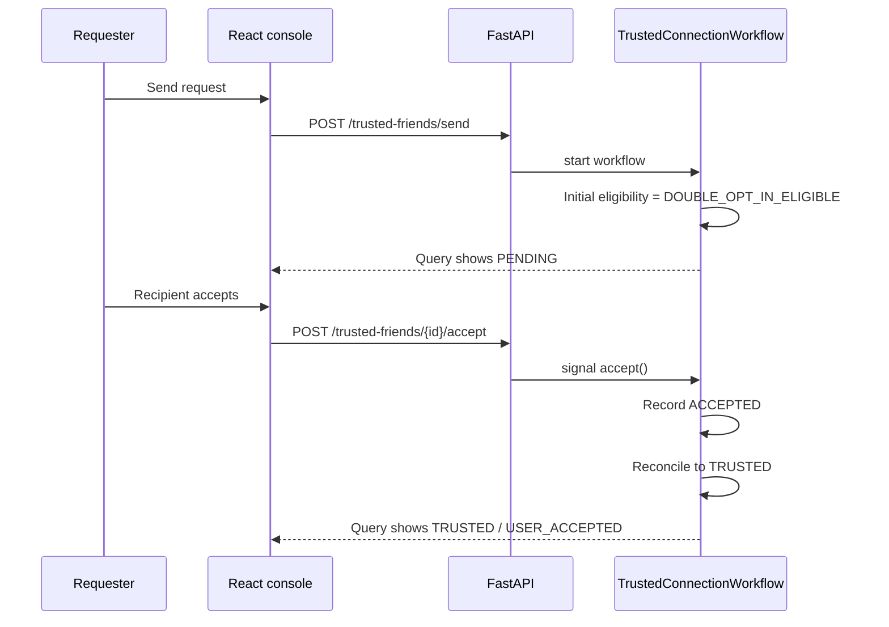
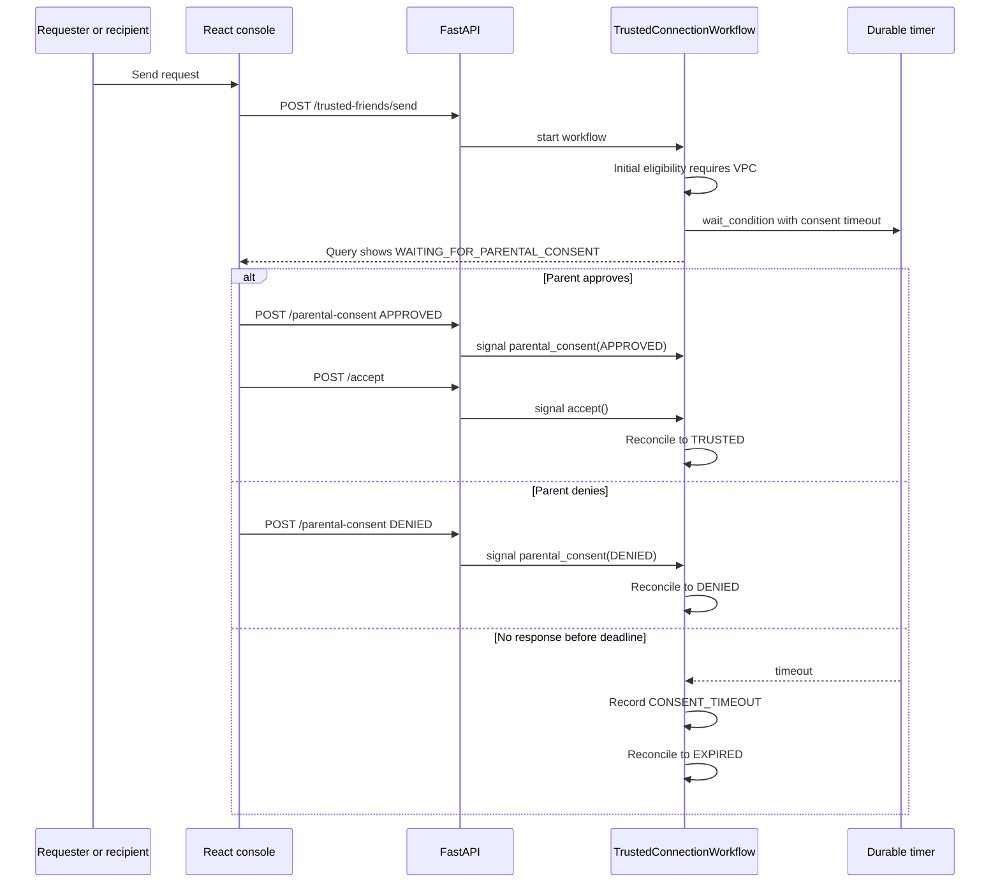
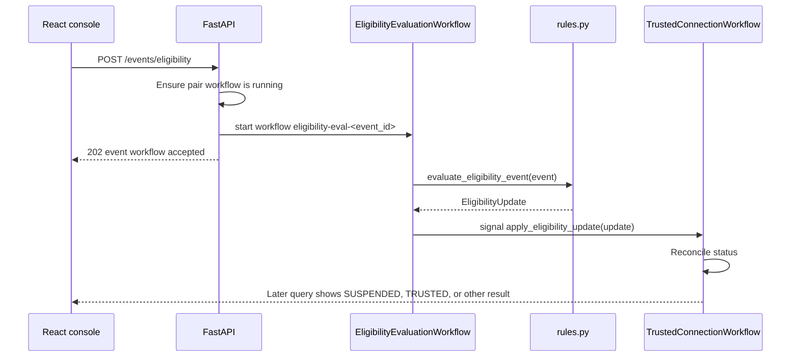
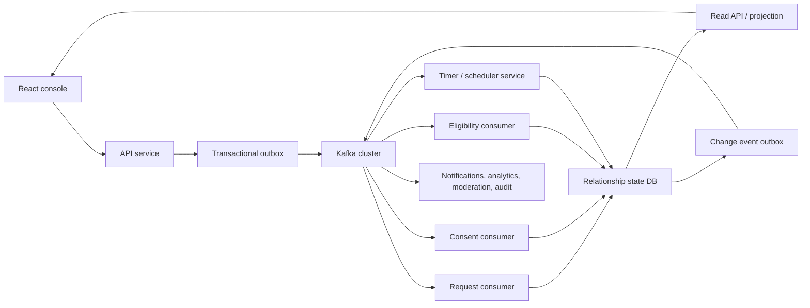
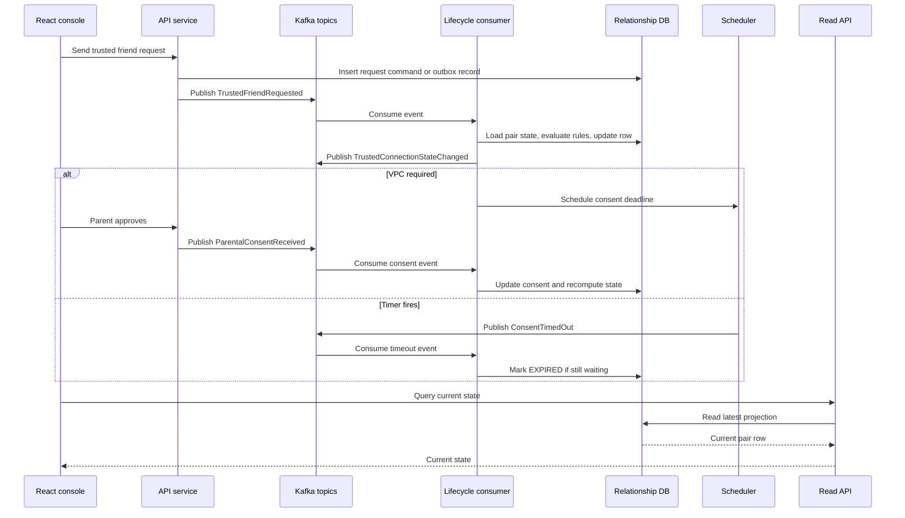
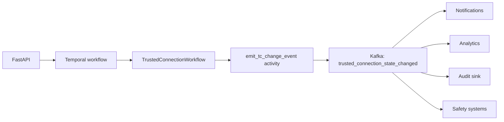

# Trusted Friends Workflow Architecture

This document explains how the Trusted Friends demo uses Temporal to own a
trusted-connection lifecycle, and how that design compares with a Kafka-based
event architecture.

The short version: Temporal is the source of truth for each pair relationship.
Kafka is excellent for distributing facts to many consumers, but a trusted
friend relationship is not just a stream of facts. It is a long-running,
interactive state machine with human approvals, timers, async eligibility
events, recovery behavior, and a need for direct queries. Temporal gives that
state machine a durable execution context.

## Core Design

Each trusted connection pair gets one long-lived Temporal workflow:

- Workflow type: `TrustedConnectionWorkflow`
- Workflow ID: `trusted-connection-<normalized-user-a>-<normalized-user-b>`
- Runtime owner: Temporal event history
- Query surface: `get_state`
- Signal surface: `accept`, `parental_consent`, `apply_eligibility_update`,
  `apply_relationship_event`, and `close`

Short-lived eligibility checks run in separate workflows:

- Workflow type: `EligibilityEvaluationWorkflow`
- Workflow ID: `eligibility-eval-<event_id>`
- Purpose: evaluate an external eligibility event and signal the pair workflow

The pair workflow owns the canonical relationship status:

- `PENDING`
- `WAITING_FOR_PARENTAL_CONSENT`
- `TRUSTED`
- `SUSPENDED`
- `EXPIRED`
- `DENIED`

The FastAPI app does not maintain a lifecycle database. It starts workflows,
sends signals, and queries workflow-owned state. The React app is a demo console
and presentation layer over those API calls.

## System Diagram



### Component Responsibilities

| Component | Responsibility | Source |
| --- | --- | --- |
| React console | Scenario selection, role previews, action buttons, active workflow controls | `frontend/src/main.tsx` |
| FastAPI app | HTTP boundary, request validation, Temporal client calls, runtime error mapping | `trusted_friends/api.py` |
| Temporal server | Durable event history, workflow execution coordination, timers, task queues | local `temporal server start-dev` |
| Temporal worker | Hosts workflow definitions and activity implementations | `trusted_friends/worker.py` |
| Pair workflow | Long-lived relationship state machine for one normalized user pair | `trusted_friends/workflows.py` |
| Eligibility workflow | Short-lived async event processor that signals the pair workflow | `trusted_friends/workflows.py` |
| Rules module | Centralized eligibility and relationship policy decisions | `trusted_friends/rules.py` |
| Activities | Fake side-effect boundaries for evaluation and event emission | `trusted_friends/activities.py` |

## The Pair Workflow

`TrustedConnectionWorkflow` is the central lifecycle owner. It keeps an internal
runtime state object with:

- pair identity and normalized user IDs
- source channel and trigger
- friendship and parent-child flags
- accepted flag
- consent requirement, status, and deadline
- current eligibility decision
- current status and reason
- transition history
- last eligibility event ID

The workflow starts with a `TrustedConnectionRequest`, evaluates initial
eligibility through an activity, records `REQUEST_CREATED`, and then runs an
event loop.



The workflow does not push every incoming signal directly into an external
store. Instead, every signal mutates workflow-owned runtime state, sets
`needs_validation`, and lets the state machine reconcile the desired status.
That makes the status derivation explicit and testable.

## State Machine

The state machine is implemented by `_RelationshipValidationStateMachine`.
Signals and internal timeout events update inputs such as `accepted`,
`consent_status`, `consent_timed_out`, and `eligibility_decision`. The
reconciliation step derives the public status from those inputs.



The public status priority is:

1. Consent timeout produces `EXPIRED`.
2. Consent denial produces `DENIED`.
3. Failed eligibility produces `SUSPENDED`.
4. Required but unapproved consent produces `WAITING_FOR_PARENTAL_CONSENT`.
5. Acceptance produces `TRUSTED`.
6. Otherwise the relationship remains `PENDING`.

This priority matters. For example, a denied parental consent should stay
terminal even if a later eligibility event arrives. The state machine enforces
that by ignoring consent and eligibility updates after terminal states.

## Start And Query Flow

The standard start flow begins with the React console and ends when the UI can
query the workflow-owned state.



The UI treats the Temporal start response as "accepted" rather than
immediately "ready". It then retries the initial query because a cold worker may
need a moment to pick up and execute the first workflow task.

## Double Opt-In Flow

In the basic flow, the requester sends a trusted friend request and the
recipient accepts. No parental approval is needed.



## VPC Approval Flow

VPC means verified parental consent. For under-13 users, or under-16 users in
configured countries, the pair remains waiting until parental consent arrives.
The workflow stores the consent deadline durably and can expire the request
without an external scheduler.



## Async Eligibility Events

Eligibility changes are modeled as short-lived workflows. The API starts an
`EligibilityEvaluationWorkflow` with a deterministic event workflow ID, and
that workflow signals the long-lived pair workflow after evaluating the event.



This split is useful because eligibility events have their own identity and
deduplication semantics. The event workflow ID uses `event_id`, and the API
uses `REJECT_DUPLICATE` for those workflows. A duplicate eligibility event
cannot start a second event processor with the same ID.

## Workflow Identity And Reuse

Pair workflow IDs are deterministic and based on the normalized user pair:

```text
trusted-connection-<first-sorted-user-id>-<second-sorted-user-id>
```

That gives the API one stable address for the pair. It also means the system can
reject accidental duplicate starts while the pair workflow is already running.

The API uses `WorkflowIDReusePolicy.ALLOW_DUPLICATE` for pair workflows. That
allows the same deterministic pair ID to be started again after the previous
workflow has completed or been closed, while Temporal still rejects another
start if the same workflow ID is currently running.

Eligibility workflow IDs are different:

```text
eligibility-eval-<event_id>
```

Those use `REJECT_DUPLICATE`, because a duplicate event ID should not be
processed twice.

## Failure Handling

Temporal records workflow progress in event history. If the worker process
dies, the server still has the workflow history. When a worker comes back, the
SDK replays history and reconstructs the workflow state before processing the
next signal, timer, activity completion, or query.

The demo uses activity retry policy for side-effect boundaries:

```text
initial interval: 1 second
maximum interval: 10 seconds
maximum attempts: 3
```

API error handling separates runtime states:

- `404 WORKFLOW_NOT_FOUND`: the workflow ID does not exist.
- `410 WORKFLOW_NOT_RUNNING`: the workflow exists but is completed,
  terminated, canceled, timed out, or otherwise not open.
- `503 TEMPORAL_UNAVAILABLE`: Temporal could not complete the operation due to
  availability, deadline, or resource issues.
- `502 TEMPORAL_RPC_ERROR` or `WORKFLOW_QUERY_FAILED`: unexpected Temporal
  query or RPC failure.

The UI surfaces these as workflow runtime issues rather than treating closed
workflows as generic broken UI state.

## Why Temporal Fits This Problem

The trusted friend lifecycle has several properties that match Temporal well:

- It is long-running. A VPC request may wait on a parent instead of completing
  inside one request-response cycle.
- It is interactive. Users and approvers can signal the workflow at different
  times.
- It has durable timers. Consent timeout belongs in the lifecycle state
  machine, not in an external cron job that must rediscover pending rows.
- It needs direct reads. The UI wants the current authoritative status for a
  pair.
- It has ordered per-pair state changes. Signals to one workflow instance are
  processed against that workflow's history.
- It has side effects at specific points. Activities isolate non-deterministic
  work such as external checks or event emission.
- It benefits from replay. State can be rebuilt from workflow history instead
  of reverse-engineering a database row from several consumers.

## Kafka-Based Alternative

A Kafka design would model the relationship lifecycle as events on topics, with
one or more consumers building state in databases or compacted topics.



A practical Kafka version would likely need:

- `trusted_friend_requests` topic
- `trusted_friend_acceptances` topic
- `parental_consent_events` topic
- `eligibility_events` topic
- `trusted_connection_state_changed` topic
- consumer groups for request, consent, eligibility, timeout, projection, and
  notification processing
- a relationship state database keyed by normalized pair
- an idempotency or inbox table for processed event IDs
- an outbox table for publishing state changes transactionally
- a scheduler or delay system for consent deadlines
- dead-letter topics for malformed or repeatedly failing events
- compaction or projections for current state reads

Kafka can support this, but Kafka itself does not own the relationship state
machine. The ownership moves into consumer code plus databases plus
deduplication tables plus scheduler infrastructure.

## Kafka Flow Diagram



The key architectural difference is where orchestration lives. In Temporal, the
orchestration is explicit in workflow code. In Kafka, orchestration emerges from
multiple consumers, topics, database updates, and scheduled events.

## Temporal vs Kafka Comparison

| Concern | Temporal workflow design | Kafka-based design |
| --- | --- | --- |
| Source of truth | One workflow history per pair owns lifecycle state | State is usually in a DB projection maintained by consumers |
| Command handling | API starts workflows and sends signals directly to the pair owner | API publishes commands/events, consumers eventually process them |
| Per-pair ordering | Signals are processed against one workflow instance | Requires partitioning by pair key and careful consumer design |
| Human-in-the-loop | Native fit through signals and durable waiting | Requires persisted pending state plus event consumers |
| Timers and deadlines | Durable workflow timers are part of the execution | Requires scheduler, delay topic, cron, or delayed queue pattern |
| Current state query | Workflow query returns authoritative in-memory reconstructed state | Requires read model or compacted topic projection |
| Failure recovery | Worker replay reconstructs state from Temporal history | Consumers replay events, but must rebuild projections and handle side effects |
| Side effects | Activities provide retry and isolation boundaries | Consumers must implement retries, idempotency, and transactional outbox logic |
| Duplicate handling | Workflow IDs and event workflow IDs provide clear dedupe boundaries | Requires message keys, processed-event tables, idempotent consumers |
| Debugging | Inspect one workflow history for the pair | Trace across topics, partitions, consumers, DB rows, and scheduler records |
| Operational footprint | Temporal server plus workers | Kafka cluster plus consumers, DB, scheduler, outbox, DLQ, projection services |
| Fanout | Possible through activities or emitted events, but not Temporal's main job | Strong fit for many independent downstream consumers |
| Analytics streams | Use emitted events downstream | Strong fit through retained topics and stream processing |

## Where Kafka Is Still Useful

The best architecture is often not "Temporal or Kafka". For this domain, a
hybrid is natural:



Temporal should own the lifecycle decision because it is the durable state
machine. Kafka can distribute the resulting facts to consumers that do not own
the pair lifecycle.

Good Kafka use cases around this workflow:

- notify other services when a connection becomes trusted or suspended
- feed analytics and experimentation pipelines
- maintain audit and compliance exports
- broadcast state changes to safety, messaging, or ranking systems
- integrate with systems that already consume Kafka topics

Less ideal Kafka use cases here:

- waiting for parental approval with a timeout
- answering "what is the authoritative state of this pair right now?"
- coordinating accept, approval, eligibility loss, restoration, and close
  behavior across several asynchronous consumers
- debugging one pair's lifecycle from request through final state

## Design Tradeoffs

Temporal is the stronger fit when the central problem is orchestration and
durable state progression. It makes the long-running lifecycle explicit and
keeps the per-pair state machine in one place.

Kafka is the stronger fit when the central problem is durable event
distribution, broad fanout, and independent downstream processing. It gives
many consumers a shared log, but it does not remove the need to design a state
machine, a read model, idempotency, and timeout handling.

For this demo, Temporal is the right primary abstraction because the core
business object is not a topic. It is a relationship that moves through a
well-defined lifecycle over time.

## Implementation Notes

- `TrustedConnectionWorkflow` should stay deterministic. Side effects belong in
  activities, not directly in workflow code.
- Rules that product or policy teams may change should stay in
  `trusted_friends.rules` and be called through activities where appropriate.
- New signals should be expressed as typed relationship events when they affect
  relationship lifecycle state.
- New async processors can follow the `EligibilityEvaluationWorkflow` pattern:
  start a short-lived workflow with a deterministic event ID, evaluate the
  event, and signal the pair workflow.
- If this grows beyond a demo, continue-as-new should be considered for very
  long-lived pair workflows with large histories.
- Kafka or another event bus should receive state-change facts from an activity
  after the workflow has reconciled state, not before the workflow owns the
  decision.
